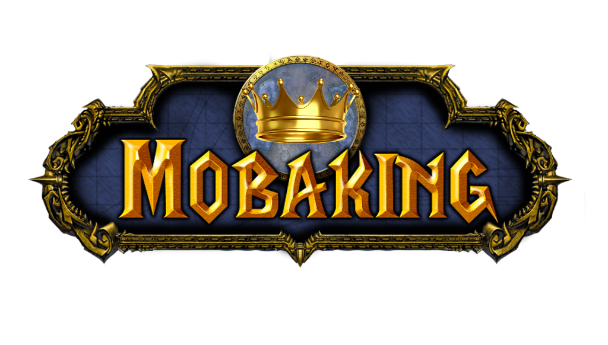

========

## Mobaking Online
Mobaking has been deployed to a open server provided by Open Shit by Redhat. If you experience lag just refresh as the server is located in USA.

[Mobaking](http://mobaking-sawankapai.rhcloud.com/)

Web app designed using [MEAN](http://mean.io/).
* version: 1.0
* Group project of the module "COMP6235 Foundations of Data Science", MSc in Computer Science, University of Southampton.

## [Colaborators](https://github.com/alu0100694765/Mobaking/graphs/contributors)
* Sawan Jagdish Kapai Harpalani. Contact: <sawankapai@gmail.com>
* Xu Han. Contact: <xh1g15@soton.ac.co.uk>
* Yingdan Xu. Contact: <yx2g15@soton.ac.co.uk>
* Peng Gou. Contact: <pg1a14@soton.ac.co.uk>
* Shanchuan Wu. Contact: <xz9a14@soton.ac.co.uk>
* Xu Zhang. Contact: <xz9a14@soton.ac.uk>

## [License](http://www.gnu.org/licenses/gpl-3.0.html) 
This project is under GNU license.

## Branches
*	[Front-End](https://github.com/alu0100694765/Mobaking/tree/web-views): Design the front end.
*	[Back-End](https://github.com/alu0100694765/Mobaking/tree/web-deb): Design back end.

## Plotting
*	barWorld.js
*	comparePlots.js
*	historicalBarLine.js
*	historicalBubble.js
*	pieChart.js
*	scatterPlot.js
*	spiderWeb.js
*	worlMap.js
*	worldStats.js

## M.E.A.N Stack [](http://mean.io/) 

MEAN is a framework for an easy starting point with [MongoDB](http://www.mongodb.org/), [Node.js](http://www.nodejs.org/), [Express](http://expressjs.com/), and [AngularJS](http://angularjs.org/) based applications. It is designed to give you a quick and organized way to start developing MEAN based web apps with useful modules like Mongoose and Passport pre-bundled and configured. We mainly try to take care of the connection points between existing popular frameworks and solve common integration problems.
### Prerequisites
* *MongoDB* - <a href="http://www.mongodb.org/downloads">Download</a> and Install mongodb - <a href="http://docs.mongodb.org/manual">Checkout their manual</a> if you're just starting.
* *Node.js* - <a href="http://nodejs.org/download/">Download</a> and Install Node.js, nodeschool has free <a href=" http://nodeschool.io/#workshoppers">node tutorials</a> to get you started.

```bash
$ curl -sL https://deb.nodesource.com/setup | sudo bash -
$ sudo apt-get update
$ sudo apt-get install nodejs
```

* *Git* - Get git using a package manager or <a href="http://git-scm.com/downloads">download</a> it.

## Import project
For using this project for futher developments or just for watching how it works, please perform the following steps:

First of all install all the dependencies using
```bash
$ cd <myApp> && npm install
```
To run the service please make sure that `mongod` is running, then just use this sentence:
```bash
$ node app.js
```
Then, open a browser and go to:
```bash
http://localhost:3000
```